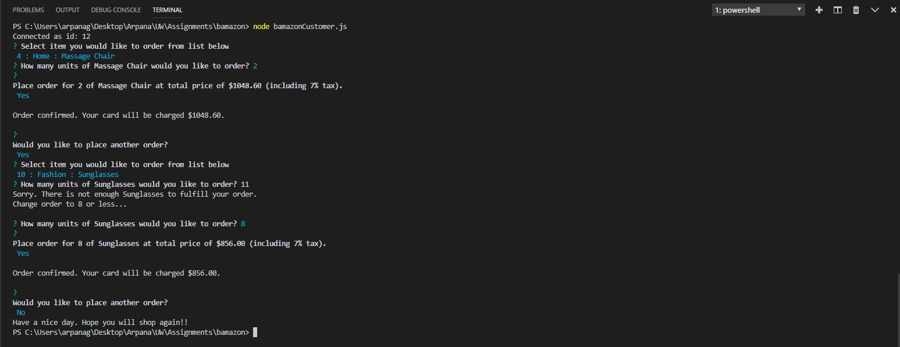
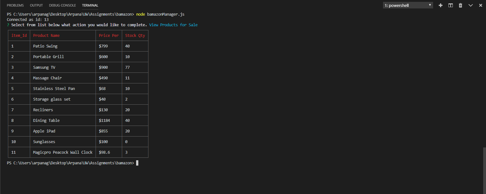
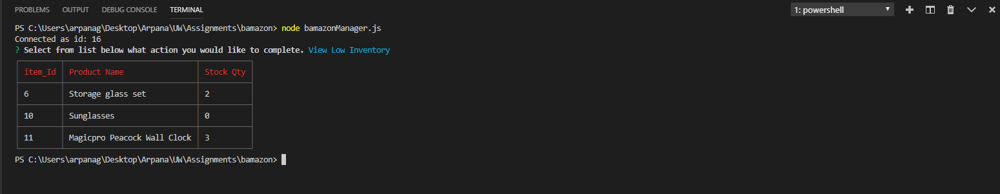
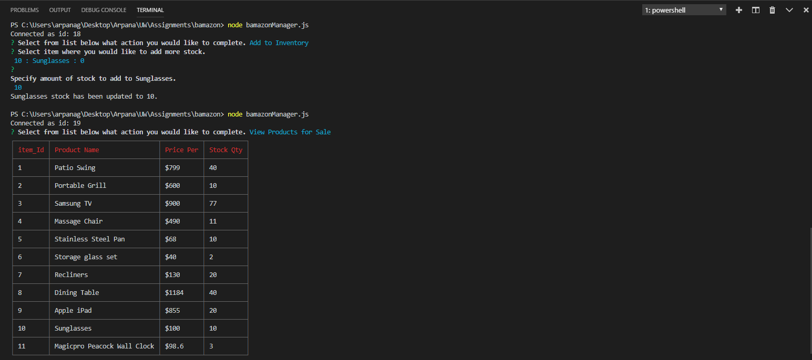
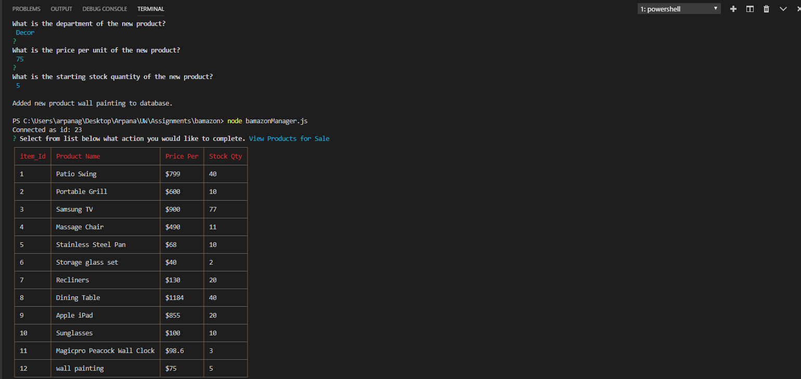
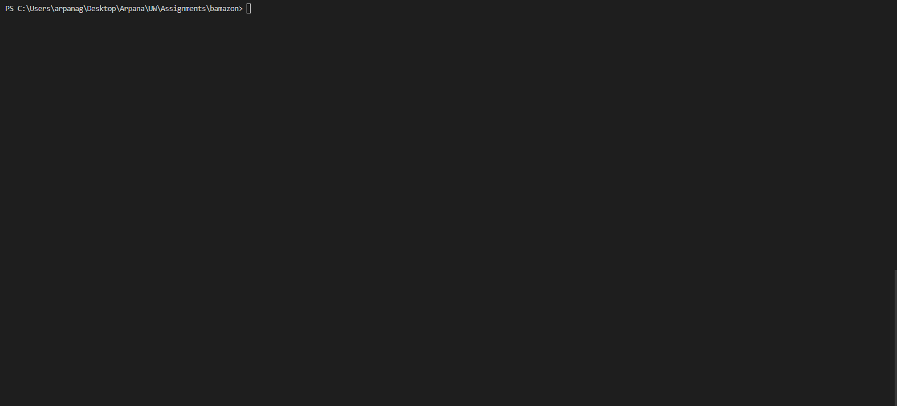

# bamazon

## Description

bamazon is a back-end application that runs on the command line and simulates an ecommerce store.

In the Bamazon customer module, you can choose from list of supplies and specify the amount of that item to order. The total cost is calculated based on the number of units ordered plus 7% sales tax. The supply ordered is deducted from the inventory and revenue from sale is added to the total product sales for that item in the database.

In the bamazon manager module, you select from a list of actions including 'View Product List', 'View Low Inventory List', 'Add Inventory', and 'Add New Product'. The "View" options retrieve information from the database and display in a formatted table in the command line. The "Add" options ask what product and the amount of inventory you would like to add or the details of the new product and update the database with the new information.

## Setup
To run the Bamazon app, clone the repository and set up a locally hosted mysql database.

Install Node Modules: npm install 
Use the bamazon-schema.sql to create the database and tables in mysql. 
Use the bamazon-seeds.sql to insert the data into the products table. 
Add password and if necessary change host, port or user values in connect.js file. 
var connection = mysql.createConnection({ 
host: 'localhost', 
port: 3306, 
user: 'root', 
password: '**Password**', 
database: 'bamazon' 
});

## **Attaching screenshot and GIF demonstarating the functioning:**

### `bamazonCustomer`
### Screenshot

### **GIF**

-------------------------------------------------------------------------------------------------------------------------------------------------------------------------------

### `bamazonManager`

### `View products for sale`
### Screenshot

### **GIF**

-------------------------------------------------------------------------------------------------------------------------------------------------------------------------------

### `View Low inventory`
### Screenshot

### **GIF**

-------------------------------------------------------------------------------------------------------------------------------------------------------------------------------

### `Add to inventory`
### Screenshot

### GIF

-------------------------------------------------------------------------------------------------------------------------------------------------------------------------------

### `Add New Product`
### Screenshot

### **GIF**

-------------------------------------------------------------------------------------------------------------------------------------------------------------------------------